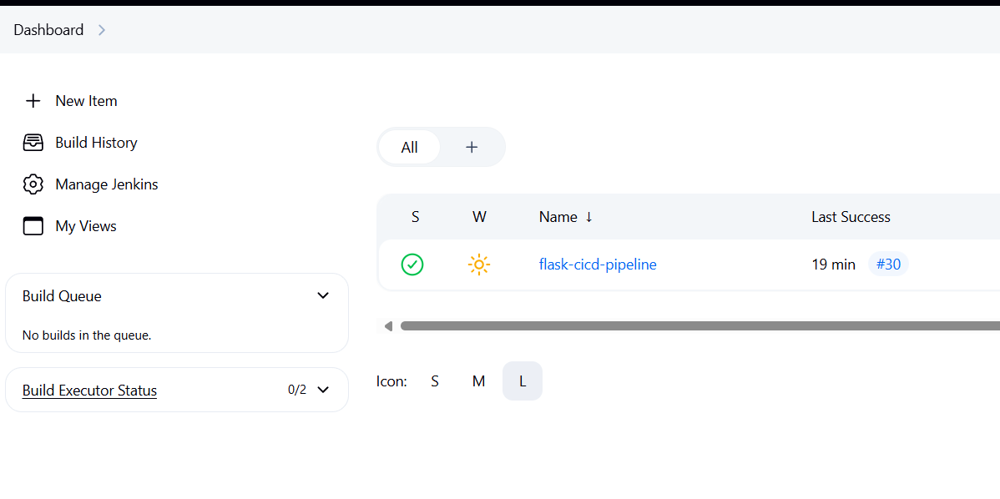
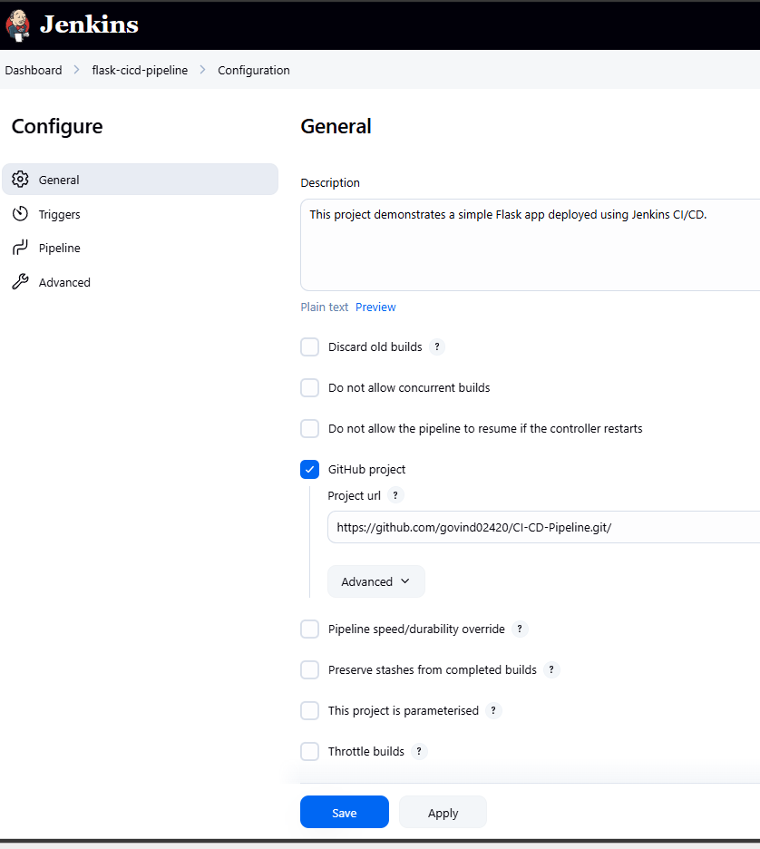
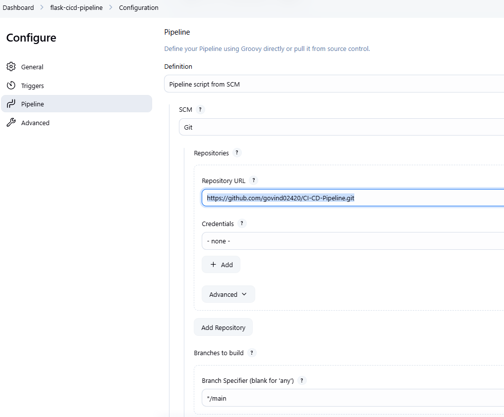
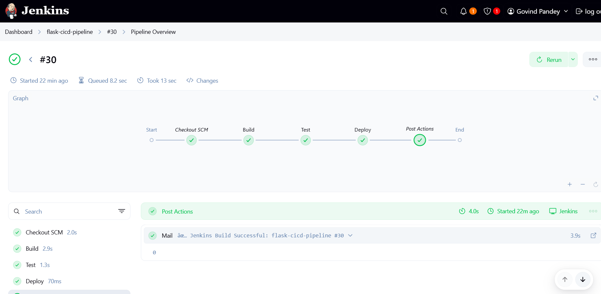
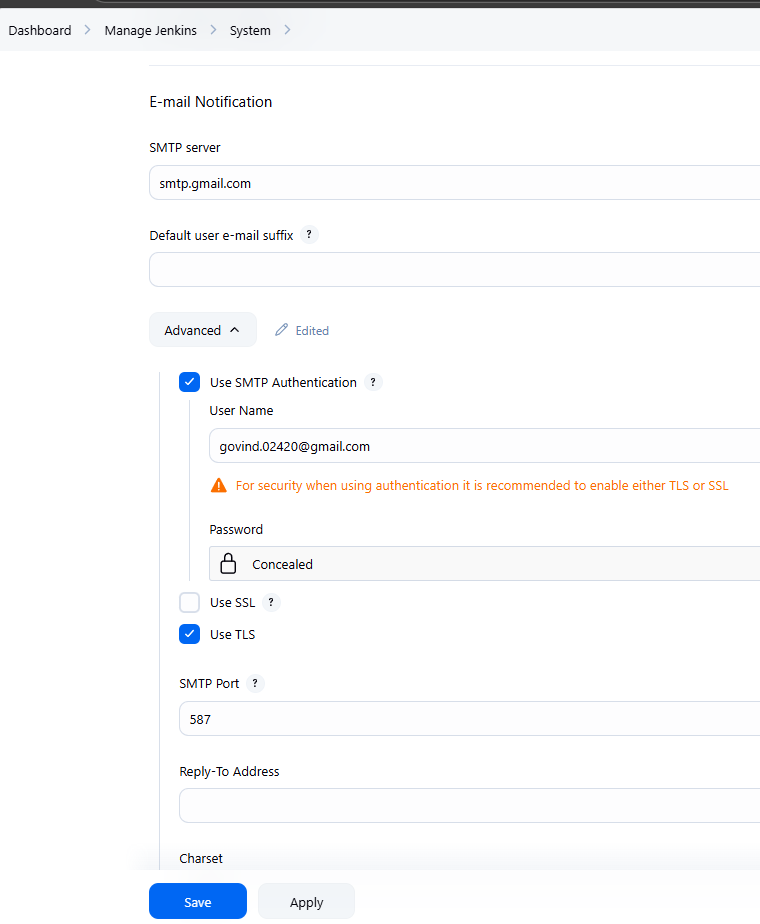
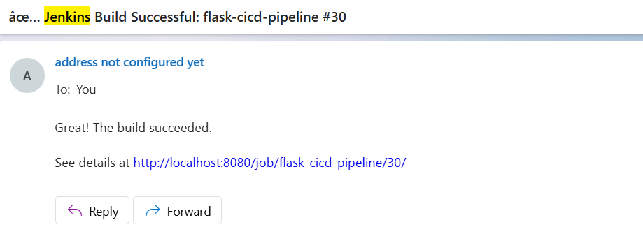

# 1.Jenkins CI/CD pipeline for flask application

This project demonstrates a CI/CD pipeline for a Flask application using Jenkins, GitHub, Pytest, and Ngrok (for GitHub webhook on local machine).

## Prerequisites
- Python 3.13 installed
- Jenkins installed locally
- Git installed
- GitHub account
- Ngrok account (Free plan is fine)


## Pipeline Stages

The pipeline includes:

- **Build**: Install project dependencies using `pip`
- **Test**: Run tests using `pytest`
- **Deploy**: Simulated deploy step using `echo`


## Project Structure
```bash
CI-CD-Pipeline/
├── app.py
├── requirements.txt
├── test_app.py
├── Jenkinsfile
└── README.md
```
## How to Run Locally

```bash
pip install -r requirements.txt
python app.py
```

## 1. Jenkins Setup
### Step 1.1: Install Jenkins
- Download from: https://www.jenkins.io/download/
- Run and access Jenkins at: http://localhost:8080

### Step 1.2: Install Plugins
- Go to Manage Jenkins → Plugin Manager, and install:
    - Pipeline
    - Git
    - Email Extension

### Step 1.3: Install Python & Git
- Ensure Python and Git are installed and in PATH:
```bash
python --version
pip --version
git --version
```

## 2. Source Code: Connect Jenkins to GitHub Repo
### Step 2.1 Fork a Sample Flask App on GitHub
Use this sample Flask web app to fork:

### Repo to Fork:
👉 https://github.com/govind02420/CI-CD-Pipeline

1. Go to the repo link.
2. Click the Fork button at the top right (if needed).
3. This will create a copy under your GitHub account.


### Step 2.2 Clone the Repository on Jenkins Server

Jenkins will do it automatically using your pipeline but to make it work correctly, make sure Jenkins has access to Git and the repo:

✅ Inside Jenkins:
1. Go to **Dashboard** → **New Item** → **Pipeline** → **flask-cicd-pipeline**
2. In the configuration page:
    - Scroll to **Pipeline** → **Definition** → **Pipeline script from SCM**
    - Select Git
    - In the **Repository URL**, paste your GitHub repo:

    ```bash
        https://github.com/govind02420/CI-CD-Pipeline.git
    ```
    - Leave credentials empty (if public repo), or configure GitHub token if private.
    - Set Branch: main (or whatever your branch is)

## 3. Jenkins Pipeline:
Create a file named **Jenkinsfile**
```bash
pipeline {
    agent any

    environment {
        PYTHONPATH = "${WORKSPACE}"
    }

    stages {
        stage('Build') {
            steps {
                bat '"C:/Users/govin/AppData/Local/Programs/Python/Python313/Scripts/pip.exe" install -r requirements.txt'
            }
        }

        stage('Test') {
            steps {
                bat '"C:/Users/govin/AppData/Local/Programs/Python/Python313/Scripts/pytest.exe"'
            }
        }

        stage('Deploy') {
            when {
                expression {
                    return currentBuild.result == null || currentBuild.result == 'SUCCESS'
                }
            }
            steps {
                echo 'Deploying...'
            }
        }
    }

    post {
        failure {
            echo 'Pipeline failed!'
        }
    }
}

```


## 4. Triggers: Automatically Build on main Branch Push
To trigger Jenkins pipeline builds automatically when you push code to GitHub’s main branch, follow these two parts:

### Part 1: Enable GitHub Webhook
Step-by-step:
1. Go to your forked GitHub repository
    ➤ https://github.com/govind02420/CI-CD-Pipeline

2. Click on ***Settings → Webhooks → Add webhook***

3. Fill in the webhook details:
- Payload URL:
```
        http://your_jenkins_ip:8080/github-webhook/              
```
    Example: http://192.168.1.10:8080/github-webhook/ (Use Jenkins VM IP)
    Example: https://abc123.ngrok-free.app/github-webhook/
    Note : you're running Jenkins on your local Windows laptop, you need to use ngrok to expose Jenkins to the internet.
- Content type: **application/json**
- Which events: **Choose Just the push event**
- Click **Add Webhook**

### Part 2: Configure Jenkins Job
For Pipeline Job:
1. Open Jenkins → your job → Configure
2. Scroll to "**Build Triggers**"
3. Check "**GitHub hook trigger for GITScm polling**"


## 5. Notifications: Email Notification Setup
- Set up a notification system to alert via email when the build process fails or succeeds.

### Step 5.1: Use App Password (Gmail)
- Enable 2FA from: https://myaccount.google.com/security
- Generate App Password for "Mail" → copy it

### Step 5.2: Configure Jenkins Email
- Go to Manage Jenkins → System → Email Notification
- SMTP Server: smtp.gmail.com
- Use SMTP Authentication: ✅
- Username: your_email@gmail.com
- Password: Your App Password
- Use TLS: ✅
- Port: 587
- Default Recipients: your email

### Step 5.3: Add Email in Job Pipeline
Edit your **Jenkinsfile** and add a post section like this:

```bash
pipeline {
    agent any

    environment {
        PYTHONPATH = "${WORKSPACE}"
    }

    stages {
        stage('Build') {
            steps {
                bat '"C:/Users/govin/AppData/Local/Programs/Python/Python313/Scripts/pip.exe" install -r requirements.txt'
            }
        }

        stage('Test') {
            steps {
                bat '"C:/Users/govin/AppData/Local/Programs/Python/Python313/Scripts/pytest.exe"'
            }
        }

        stage('Deploy') {
            when {
                expression {
                    return currentBuild.result == null || currentBuild.result == 'SUCCESS'
                }
            }
            steps {
                echo 'Deploying...'
            }
        }
    }

    post {
        success {
            mail to: 'govind.02420@gmail.com',          // yourname@gmail.com
                 subject: "✅ Jenkins Build Successful: ${env.JOB_NAME} #${env.BUILD_NUMBER}",
                 body: "Great! The build succeeded.\n\nSee details at ${env.BUILD_URL}"
        }

        failure {
            mail to: 'govind.02420@gmail.com',          // yourname@gmail.com
                 subject: "❌ Jenkins Build Failed: ${env.JOB_NAME} #${env.BUILD_NUMBER}",
                 body: "Oops! The build failed.\n\nCheck logs at ${env.BUILD_URL}"
        }
    }
}

```
## Outcome
1. ✅ Jenkins fetches the latest code from GitHub repository on every push to main branch.
2. ✅ Build stage installs all required Python dependencies using pip.
3. ✅ Test stage runs unit tests using pytest.
4. ✅ Deploy stage is triggered after successful tests (can be extended to real deployment).
5. ✅ Email notifications are sent on both build success and failure.
6. ✅ GitHub Webhook integrated via ngrok to enable automatic builds on local Jenkins after every GitHub push.


## Screenshots

### Jenkins_Dashboard


### Source_Code
#### Connect_1

#### Connect_2


### Triggers
#### Git_Webhook

#### Jenkins_Job


### Jenkins_Build_Sucess


### Email_Notification_Setup


### Notification_Alert_via_Email



#
# 2.GitHub Actions CI/CD Pipeline Flask App

This repository includes a CI/CD workflow using GitHub Actions.

### Workflow Summary:

- On push to `staging`: 
  - Installs dependencies
  - Runs tests using pytest
  - Deploys to staging if tests pass

- On release tag:
  - Installs dependencies
  - Runs tests
  - Deploys to production

### Secrets Used:

- `STAGING_API_KEY` – Key used for staging deployment
- `PROD_API_KEY` – Key used for production deployment

Configure these in GitHub > Settings > Secrets > Actions.

## Step 1:GitHub Repository Setup
- Create branches:
    - main → production-ready code
    - staging → for pre-deployment and testing

```bash
git checkout -b staging
git push origin staging

```

## Step 2:Create Workflow Directory
- Inside your repo, structure like this:
```bash
.github/
└── workflows/
    └── flask-ci-cd.yml
```

## New Project Structure
```bash
CI-CD-Pipeline/
├── app.py
├── requirements.txt
├── test_app.py
├── Jenkinsfile
├── README.md
└── .github/
    └── workflows/
        └── flask-ci-cd.yml
```

## Step 3:Write flask-ci-cd.yml Workflow
```bash
name: Flask CI/CD Pipeline

on:
  push:
    branches: [ staging, main ]
  pull_request:
    branches: [ staging, main ]
  release:
    types: [created]

jobs:
  build-test:
    runs-on: ubuntu-latest

    steps:
      - name: Checkout code
        uses: actions/checkout@v4

      - name: Set up Python
        uses: actions/setup-python@v5
        with:
          python-version: '3.10'

      - name: Install dependencies
        run: |
          python -m pip install --upgrade pip
          pip install -r requirements.txt

      - name: Run tests
        run: |
          pytest

  deploy-staging:
    needs: build-test
    if: github.ref == 'refs/heads/staging'
    runs-on: ubuntu-latest
    steps:
      - name: Deploy to staging
        run: |
          echo "Deploying to staging..."
          # Add your real staging deployment script here
        env:
          STAGING_API_KEY: ${{ secrets.STAGING_API_KEY }}

  deploy-prod:
    needs: build-test
    if: github.event_name == 'release'
    runs-on: ubuntu-latest
    steps:
      - name: Deploy to production
        run: |
          echo "Deploying to production..."
          # Add your production deployment command/script here
        env:
          PROD_API_KEY: ${{ secrets.PROD_API_KEY }}

```

## Step 4: Add GitHub Secrets
- Go to your repository → Settings → Secrets and Variables → Actions → New repository secret
    - Add:
        - STAGING_API_KEY
        - PROD_API_KEY

## Screenshots for Submission

### Actions_Secrets_and_Variables


### Test_Session


